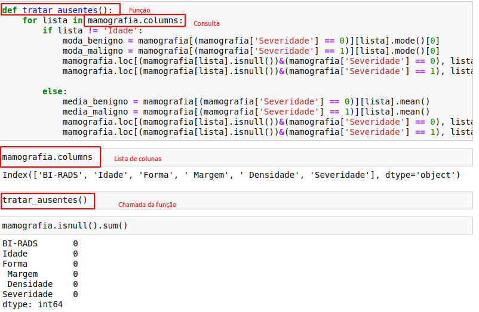
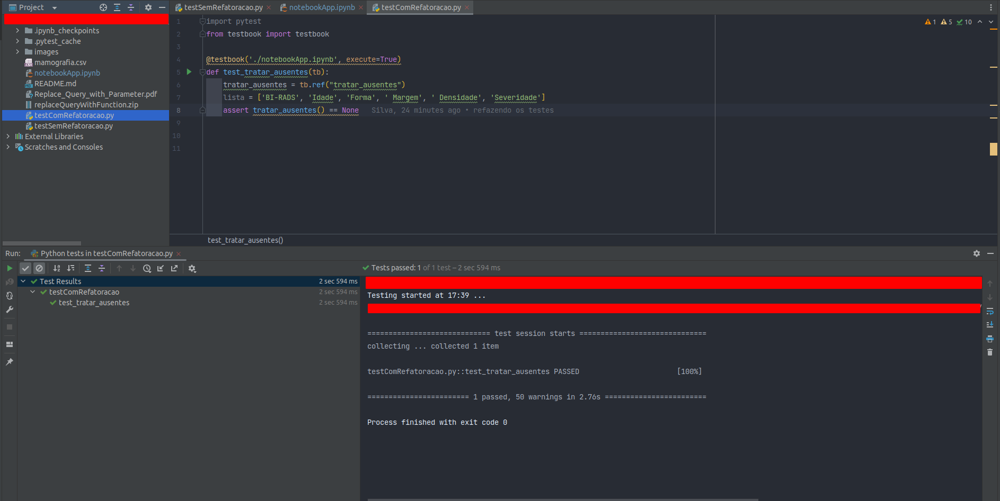
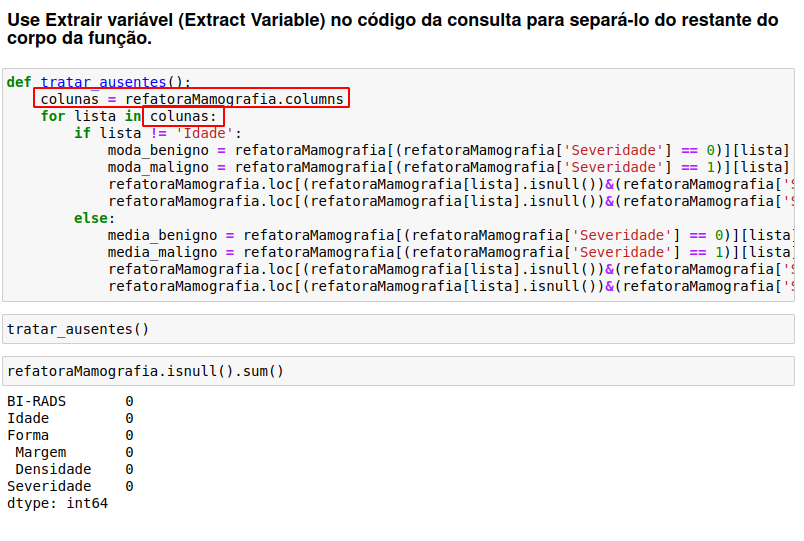
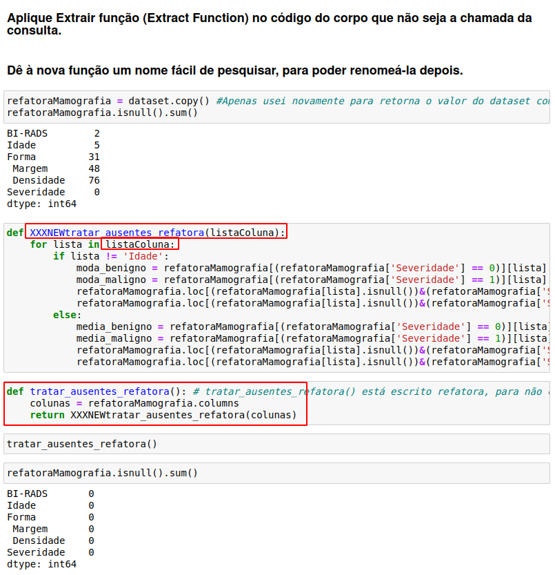
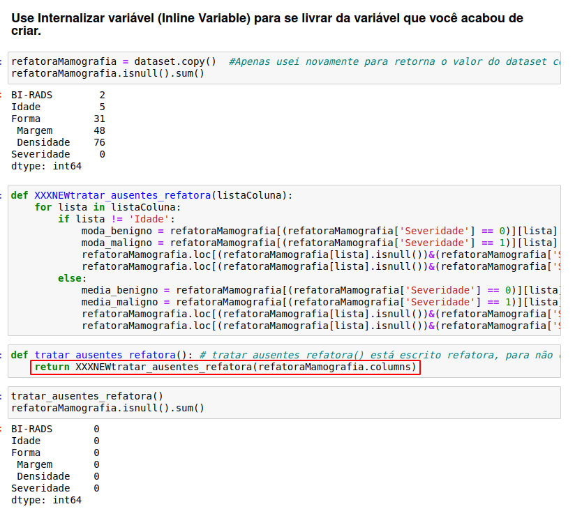
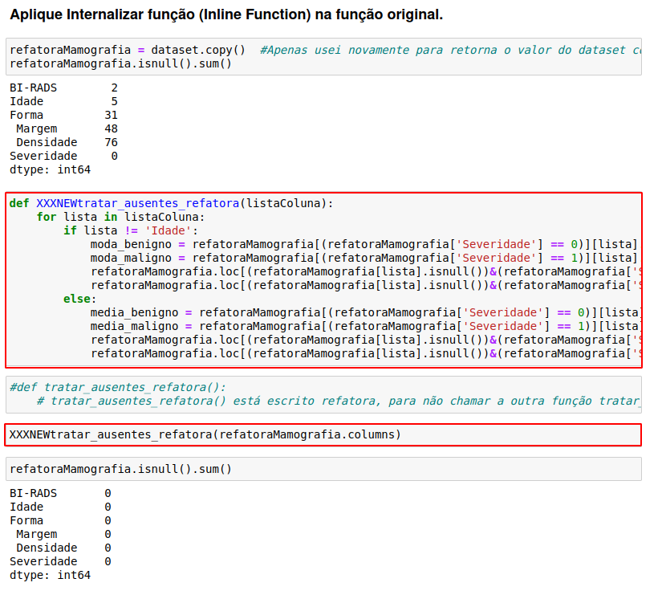
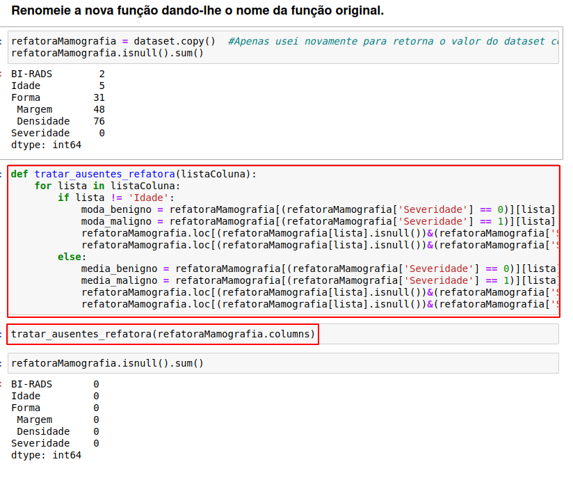
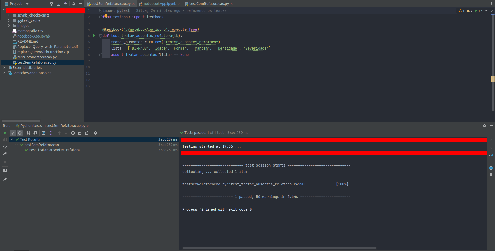

# Replace Query with Parameter

🎓 College: [Faculdade Metodista Granbery](http://granbery.edu.br/)

👨‍🏫 Teacher: [Marco Antônio - Github](https://github.com/marcoaparaujo) | [Linkedin](https://www.linkedin.com/in/marco-ant%C3%B4nio-ara%C3%BAjo/)

📗 Book: [Refatoração - Aperfeiçoando o design de códigos existentes - Martin Fowler](https://www.amazon.com/-/pt/dp/B087N8LKYB/ref=sr_1_1?__mk_pt_BR=%C3%85M%C3%85%C5%BD%C3%95%C3%91&crid=M4T29CCKD30E&keywords=refatora%C3%A7%C3%A3o&qid=1651322207&sprefix=refatora%C3%A7%C3%A3o%2Caps%2C203&sr=8-1)

> FOWLER, Martin. “Replace Query with Parameter” no código. *In*: REFATORAÇÃO: Aperfeiçoando o design de códigos existentes. 2. ed. [*S. l.*: *s. n.*], 2019. cap. 11.
> 

## Método

Objetivo desse método e retirar a consulta dentro função que está em uma dependência indesejada e trazer uma função que traga sempre o mesmo resultado  que se chama transparência referencial. 

## Código

O código que escolhi foi uma atividade dado em aula pelo Professor Ricardo. Essa função recebe um parâmetro de nomes de coluna do dataset, os dados são verificados pela sua severidade e depois ocorre sua substituição dos valores ausentes de acordo com o seu tipo.

O código pode ser encontrado na plataforma [Kaggle](https://www.kaggle.com/code/edmilsoneddi/data-mining-discipline-exercise)

## Ferramentas

```bash
    pip install ipytest
```

```bash
    pip install testbook
```

```bash
    pip install pandas
```

```bash
    pip install jupyter
```

## Objetivo da atividade

1. Elabore ou escolha um código que a refatoração possa ser aplicada.
2. Identifique o mau cheiro associado.
3. Escreva os casos de teste e execute
4. Aplique a refatoração
5. Execute os casos de teste novamente
6. Documente cada etapa para a apresentação

## Mau Cheiro

### Lista longa de parâmetros

O mau cheiro que encontrei dentro do código abaixo foi o lista longa de parâmetros, sendo que esse mal cheiro é para método ‘Replace Parameter with Query’, mas esse método e o inverso do ‘Replace Query with Paramater’, sendo assim o seu mal cheiro será o inverso. O mal cheiro será de **consultas longas** que trazem **confusão** para realizar a **compreensão do código**. 

## Procedimento

## Código sem refatoração



## Teste sem refatoração



## Código novo aplicando a refatoração

## Use Extrair variável (Extract Variable) no código da consulta para separá-lo do restante do corpo da função.



## Aplique Extrair função (Extract Function) no código do corpo que não seja a chamada da consulta.

## Dê à nova função um nome fácil de pesquisar, para poder renomeá-la depois.



## Use Internalizar variável (Inline Variable) para se livrar da variável que você acabou de criar.



## Aplique Internalizar função (Inline Function) na função original.



## Renomeie a nova função dando-lhe o nome da função original.



## Realização do Teste

